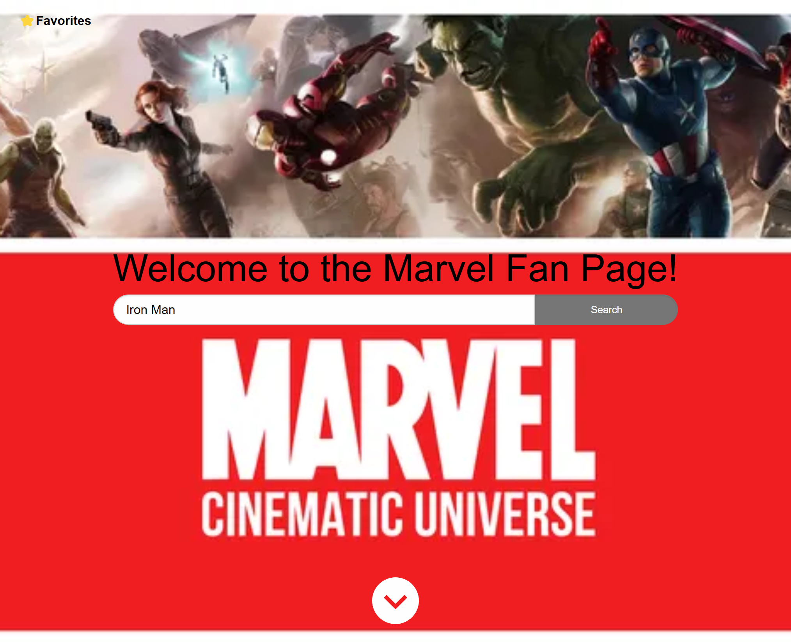

# collaboration

## Description

This webpage provides fans of marvel movies a suggstion of comics they could read if they wanted to know more about their favorite characters. The page uses API data from Marvel to pull up 5 comics that contain the character you chose, as well as accessing the Giphy API to display a fun gif. For styling, the page uses Foundation. 

## Usage

On the homepage, you can enter the name of any Marvel character you like. Upon clicking "Search", if the character is a valid Marvel character, the page will show a random gif of the character as well as 5 comics featuring them. If it is not a valid Marvel character, it will still generate a gif but the comic suggestion box will advise you that the character is not found, check spelling and spacing. 

## Credits

Melissa https://github.com/melivesel

Jermar https://github.com/Jermar318

Vaughan https://github.com/vaughanknouse

Kyle https://github.com/kdolan28

Marvel API https://developer.marvel.com/

Git API https://developers.giphy.com/

Foundation Framework https://get.foundation/

## Deployed Application Link
https://melivesel.github.io/collaboration/

## License

Please refer to the license referenced in the repo

